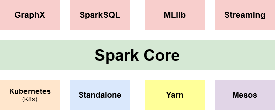

# spark_K8s

RoadMap Project :
Spark Installation on Kubernetes Steps :
- 1 Introduction and Architecture
- 2 Installation Of spark 
- 3 Installation Of  Kubernetes
- 4 Running Your First spark Code on Kubernetes

## I.Spark Architecture

