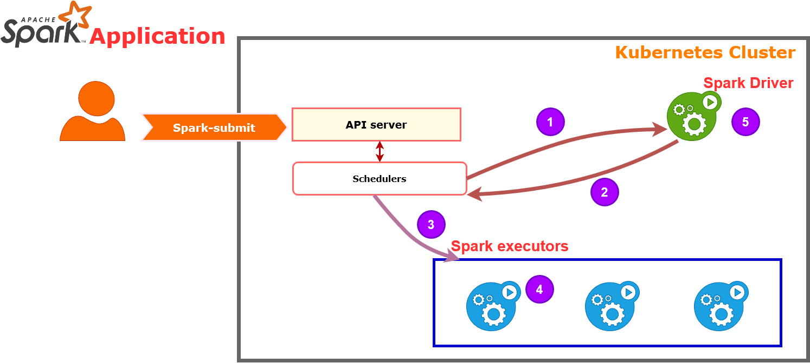

# Spark on Kubernetes (K8s)

RoadMap Project :
Spark Installation on Kubernetes Steps :
#### - 1 Spark Introduction and Architecture 
#### - 2 Spark Installation
#### - 3 Kubernetes Introduction and Architecture 
#### - 4 Kubernetes Installation
#### - 5 How Spark interacte with Kubernetes?
#### - 6 Running Your First spark Code on Kubernetes

## 1. Spark Architecture
First of all let's introduce spark ecosystem then we will see the main spark architecture components and Features.

**What's Spark ?**

Apache Spark is an open-source, distributed processing system used for big data workloads. It utilizes in-memory caching and optimized query execution for fast queries against data of any size. Simply put, Spark is **a fast and general engine for large-scale data processing.** 

Spark ecosystem can be used for several kind of projects like running Distributed SQL, creating data Pipeline, ingesting data into different databases, running machine learning algorithms by using **SparkML** component,building stream proccessing and working with graphs using **graphX**  

**What about the Spark Architecture?** :

- **1 Apache Spark Core** 
 Spark Core is general execution engine for the Spark platform, and all other functionality is built upon. It provides in-memory computing and referencing datasets in external storage systems.
 
- **2 Spark SQL**
 Spark SQL integrates relational processing with Spark’s functional programming. It provides support for various data sources and makes it possible to use SQL queries with code transformations thus resulting in a very powerful tool.
 
- **3 Spark Streaming**
 This Component allows Spark to proccess real-time streaming data (pseudo-real-time), the data can be ingested from many sources RabitMQ, Kafka, Flume, then it will be processed using complex algorithms and finaly it will pushed ot to databases, file system (HDFS), or live  dashboard.

- **4 Spark GraphX**
 Is an other component to handle and manipulate graph databases, GraphX has ETL (Extract, Transform, Load) process, exploration with the first analysis and iterative graph computation within a single system, to get more insights, read  [link to visit](https://medium.com/@rukavitsya/introduction-to-spark-graphx-748f5bbcddc5)
 
- **5 MlLib (machine learning Lib)**
 MlLib is machine learning library, that contains a very large machine learning Algorithms like clssification, regression, Clustring, and in the same single compnent, it includes other tools to get a tunning Ml pipelines.
 
**Spark Features**

- **Fast processing** – 
The most important feature of Apache Spark is a higher speed Processing . Spark contains Resilient Distributed Dataset (RDD) which saves time in reading and writing operations, allowing it to run almost ten to one hundred times faster than Hadoop Mapreduce.

- **Flexibility** –
Apache Spark supports multiple languages and allows the developers to write applications in Java, Scala, R, or Python.

- **In-memory computing** –
Spark stores the data in the RAM of servers which allows quick access and in turn accelerates the speed of analytics.

- **Real-time processing** –
Spark is able to process real-time streaming data. Unlike MapReduce which processes only stored data, Spark is able to process real-time data and is, therefore, able to produce instant outcomes.

- **Better analytics** –
In contrast to MapReduce that includes Map and Reduce functions, Spark includes much more than that. Apache Spark consists of a rich set of SQL queries, machine learning algorithms, complex analytics, etc. With all these functionalities, analytics can be performed in a better fashion with the help of Spark.

## 2. Spark Installation

After this breaf Apache spark introduction, Architecture and features , let deep dive into installation and configuration of spark. 
Note :  The configuration is Standalone Configuration

/////////////////////////////////////////////////////////////

/////********  DO it in your Personal Computer   ******** ///

/////////////////////////////////////////////////////////////

After we see how we can Insall and configure Spark and jupyterLab let's take further steps toword Kubernetes ( Don't forget our aim !!, Spark on kubernetes 😉 )

## 3. Kubernetes (K8s)
Here we go let's get the answers for this Questions: What's Kubernetes, What is his architecture What are his compenents? 

**What is Kubernetes **

Kubernetes (also known by K8s) is an open source apllication containers management tool, Kubernetes comes with a capability of automating deployment, scaling of application, and operations of application containers (e.g Saprk application is application of spark) across clusters. It is capable of creating container centric infrastructure.

**What about Kubernetes (K8s)Architecture ?**

Lets deep dive, to see the role of each component:
** Master Node** : Receive imput from spark application ``spark-submit``, this this command you difine the pods, replica sets and service that you want Kubernetes to maintain.
  - **API server** : The main point of interaction externally  an internally with other components
  - **Key-Value Store (etcd)** : is database Kubernetes used to back-up all cluster data, it stores all configuration and state of cluter (e.g Which Pod is down,...)
  - **Controller** : The role of controller is to obtain disered state from API server, it checks current state of each nodes.
  - **Scheduler** : Watch the new request comes from API server and assigns it to healty nodes, and the best suitable nodes.

**Worker Node** :
it listen to the API server (in master node), for the new work assignements,than they excute the work assignements and the send the results back to the K8s master node. It contains:
 - **Kubelet**: it's the principale kubernetes agent, it runs on each configured worker nodes, it watches for tasks sent form API server, excutes the tasks, give back the reports to the master node, and monitor the Pods. 
 
 - **container runtime** : it pulls the image from container image registry and starts and stops containers, this role can be played by 3rd party software like Docker.
 - **Kube proxy** : makes sure that each node gets its IP adress, and this the first entry point to access into node  
 - **Pod** : The smallest element of scheduling in K8s, and if You want the scale up/down your app, you can only do so by adding or removing pods. Without Pod a container can't be part of cluster
Note : To get more information about architecture, I really recommend to you this article [Kubernetes architecture](https://www.aquasec.com/wiki/display/containers/Kubernetes+Architecture+101), Happy reading 📖

**Kubernetes Features**

Following are some of the important features of Kubernetes.
 - Continues development, integration and deployment
 - Containerized infrastructure
 - Application-centric management 
 - Auto-scalable infrastructure
 - Environment consistency across development testing and production
 - Loosely coupled infrastructure, where each component can act as a separate unit
 - Higher density of resource utilization
 - Predictable infrastructure which is going to be created

One of the key **components of Kubernetes** is, it can run **application on clusters of physical and virtual machine infrastructure**. It also has the capability to run applications on cloud.

## 4. Kebernetes Installation

The time arrived to get hands dirty 😎, Let's do our Kubernetes installation

Note :  The configuration is Standalone Configuration

/////////////////////////////////////////////////////////////

/////********  DO it in your Personal Computer   ******** ///

/////////////////////////////////////////////////////////////

## 5.How Spark interacte with Kubernetes?

Spark Core uses cluster manager to run Spark application on cluster spark (version 2.4.4 ) support Yarn, Mesos, standalone and Kurbernetes as cluster manager. 

After runnig Spark-submit job to K8s, The API server gets this Command then :

**1** K8s Shedules the driver (spark driver) for job

**2** Driver requests executors as needed

**3** Excutors scheduled and created

**4** Executors run tasks 

**5** Driver completes job and persists logs

------------

links
* https://spark.apache.org/docs/latest/cluster-overview.html
* https://databricks.com/session/apache-spark-on-kubernetes
* https://spark.apache.org/docs/latest/submitting-applications.html
* https://blog.risingstack.com/what-is-kubernetes-how-to-get-started/

